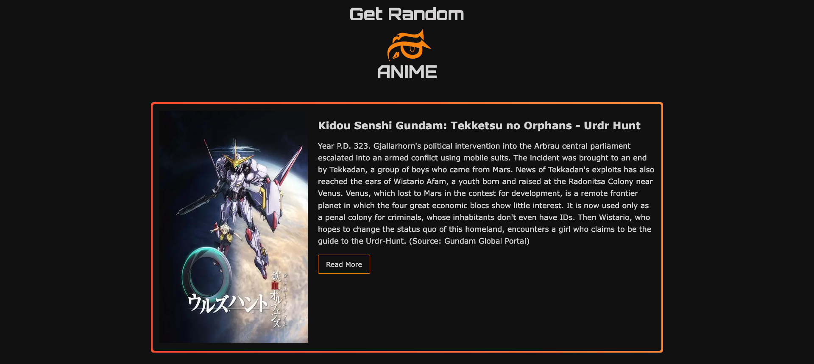

# Get Random Anime

This project fetches and displays a random anime from an external API. The goal of this project was to gain experience using APIs while building a fun and simple application.



## Features
- Fetches a random anime with key information such as title, image, and synopsis.
- Responsive design for mobile, tablet (iPad), and larger screens.
- Minimal styling focused on functionality.

## Technologies Used
- **Node.js**: JavaScript runtime for server-side programming.
- **Express.js**: Framework for routing and handling HTTP requests.
- **Axios**: For making HTTP requests to the anime API.
- **EJS (Embedded JavaScript)**: For templating.

## How to Run the Project

1. **Clone the repository**:

   ```bash
   git clone https://github.com/ammarjw/get-random-anime.git
   cd get-random-anime
   ```

2. **Install dependencies**:

   ```bash
   npm install
   ```

3. **Create a `.env` file** in the project root and add your API URL and port:

   ```plaintext
   API_URL=https://api.jikan.moe/v4
   PORT=3000
   ```

   Alternatively, you can change the `API_URL` constant in your code to a string if you prefer not to use a `.env` file.

4. **Run the app**:

   You can run the app using Nodemon to auto-reload on changes:

   ```bash
   nodemon index.js
   ```

   If you prefer not to use Nodemon, you can start the server with the default command:

   ```bash
   node index.js
   ```

   Note: Nodemon will restart the server when changes are detected.
   
   ### Quick tip

    If Nodemon isn't installed, you can install it globally:
    ```bash
    npm install -g nodemon
    ```

    Then, run the app with:
    ```bash
    nodemon index.js
    ```

6. **Open the app**:  
   Once the server is running, open your browser and navigate to `http://localhost:3000` to see the app in action.

## Notes
The project is basic and focuses on functionality with minimal styling, but it is responsive and adapts well to mobile, tablet, and larger screens.
